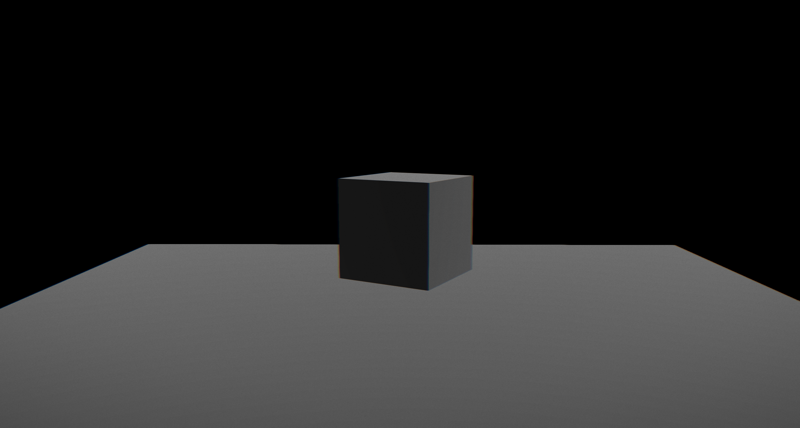

# three-template-ts

This is a template using threejs and ore-three.



# Install

## packages

```
npm install
```

## submodules

```
git submodule init
git submodule update
```

# Run

```
npm run dev
```

# Build

```
npm run build
```